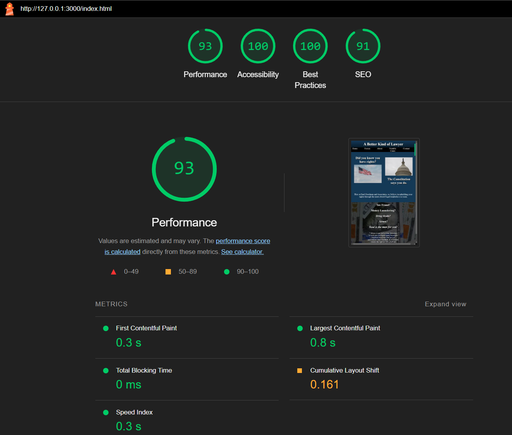
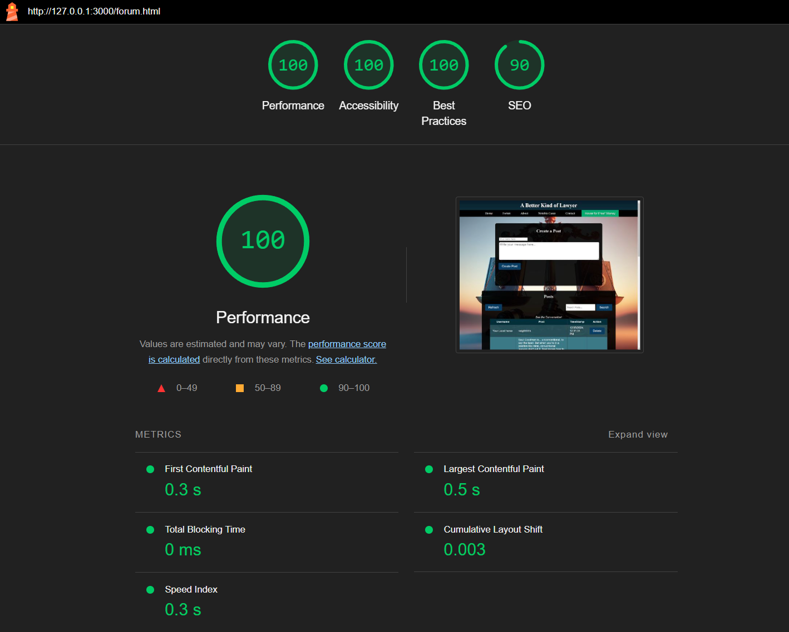
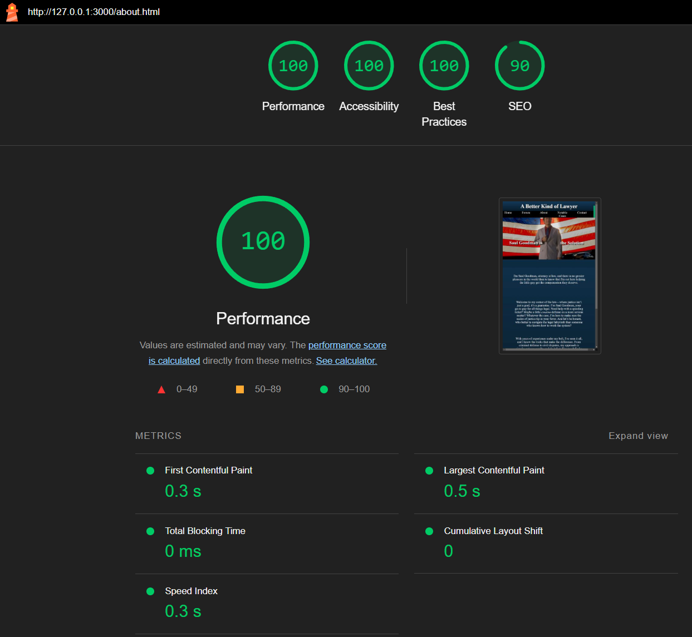
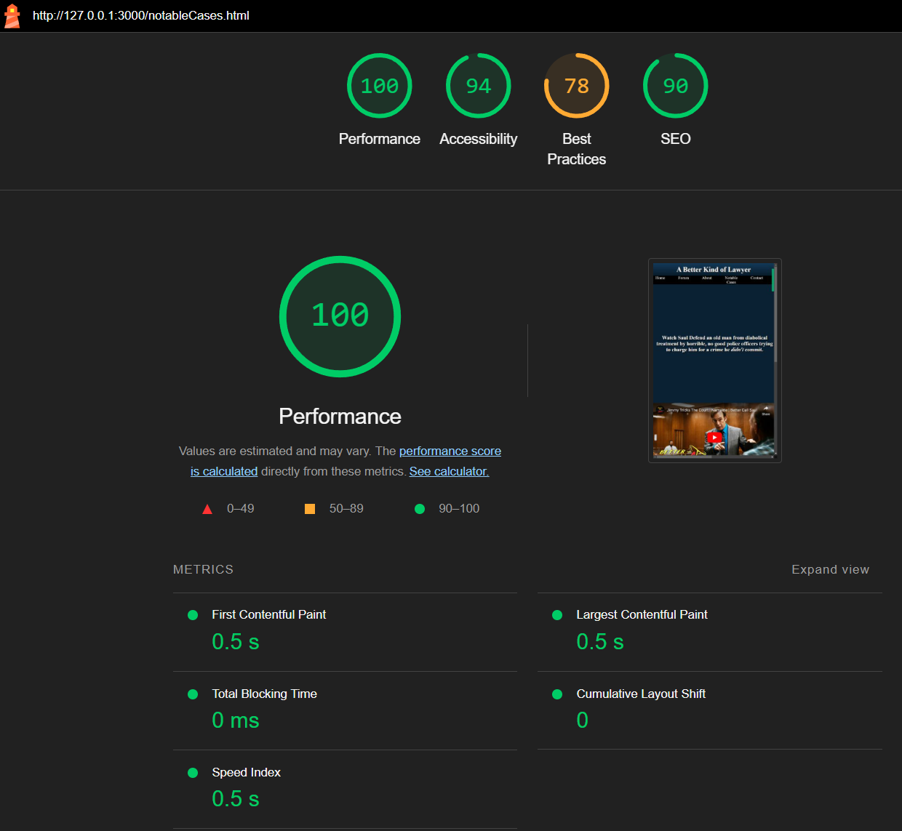
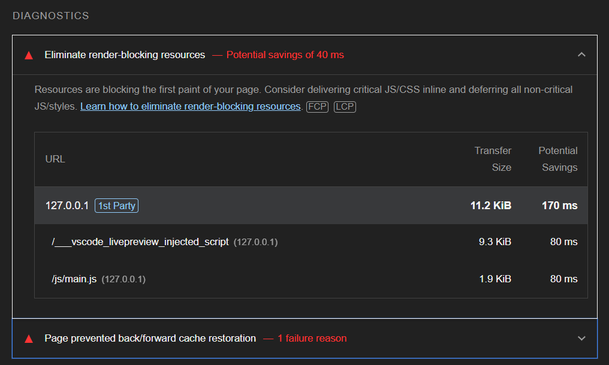
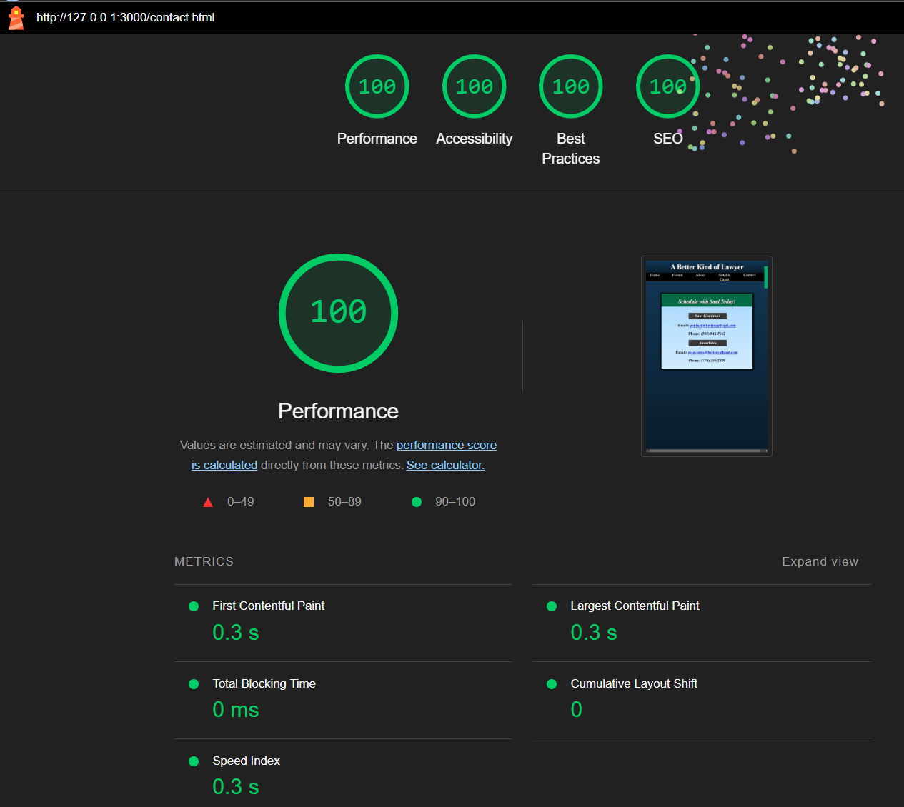

# Web Dev Final Project

## Usage / Running the Program:
First, clone this repository to a new directory on your system. 

> There are two ways to run this program: (1) Through the LivePreview extension in VSCode, and (2) by debugging the website in VSCode (recommended).

#### Running via Terminal / Browser
1. Navigate to the cloned repository.
2. Enter the following into your terminal: `./index.html`

#### Running via LivePreview in VSCode
1. Open up this project in VSCode (and if you don't have it already, download and install the `LivePreview` extension).
2. Select `index.html` in the explorer pane. Then, select the `live preview` button that appears in the top right corner to load the webpage into a window in VSCode.

#### Running via Debug Website (recommended)
1. Open up this project in VSCode.
2. Navigate to the `Run and Debug` pane (option located on the left side of the screen).
3. Select `Run and Debug` --> `Debug Website`. A new window will open in your browser where you can interact with the site.

## Project Specifications:

### General Theme
This project represents a complete website, that in an alternate universe, might have been used by
lawyer Saul Goodman (from Breaking Bad). It will be a combo photo gallery and user interface for users to learn more about the lawyer. Unlike the hokey lawyer, this will meet the best of ethical standards and will be an honest attempt to create a "coorporate" looking website that a practicing lawyer might use while on the job. 

### What it will do
There are 5 webpages that will be accessible on the site, each of them are detailed below:

1. **Landing Page**: The landing page will be the page viewers initially land on when they open up the website. It will include a menu bar across the top with links to each page, and a large centered text column containing pictures and an 'ad' for Saul's business.

2. **Forum**: The forum will maintain the same general layout with the menu bar and center column, but will instead contain a scrollable window where the user can browse reviews and conversations about Saul and his services. On the side of the page, there will be buttons allowing a viewer to create a new post. The backend of this forum will be powered using AWS and the backend that we've developed in our labs.

3. **Notable Cases**: This webpage will have a two column layout that shows embedded videos and text testimonials of notable cases that Saul Goodman has worked on.

4. **About BCS**: This page serves as an "About Me" section, which will detail information about Saul, such as his education, where he comes from, and how long he's been practicing for

5. **Contact**: This last webpage will show contact details for users to get in contact with Mr. Goodman.

### Target Audience
The target audience is the general public, or individuals interested in acquiring Mr. Goodman's services. 

### Stretch Goals
As a stretch goal, I would like to make the `contact` page contain either a form from which users can send emails to Mr. Goodman regarding their cases, or create a booking system in which users can select a date and time to meet with Mr. Goodman. 

## Project Wireframe

## Additional Testing not shown in Project Code
I took some time to run my webpages through Google Chrome's [Lighthouse](https://developer.chrome.com/docs/lighthouse/overview#devtools)- which is an open source tool for measuring the accessibility, performance, and SEO of webpages.

The following images show my lighthouse results:
- Home Page

- Forum

- About

- Notable Cases

*Upon inspection, the score for Best Practices is primarily caused by the number of embedded YouTube videos on the page. See sample screenshot.*

- Contact

## Reference Links / Citations
- [Nav Bar Guide](https://www.w3schools.com/css/css_navbar_horizontal.asp)
- [Dropdown Menu Guide](https://www.w3schools.com/howto/howto_js_responsive_navbar_dropdown.asp)
- [Animating Money Button](https://developer.mozilla.org/en-US/docs/Web/CSS/CSS_animations/Using_CSS_animations)

(More about animating the money button)
- [Event Listeners](https://developer.mozilla.org/en-US/docs/Web/API/EventTarget/addEventListener) 
- https://dev.to/jeetvora331/throttling-in-javascript-easiest-explanation-1081
- https://developer.mozilla.org/en-US/docs/Web/JavaScript/Reference/Functions/rest_parameters 
